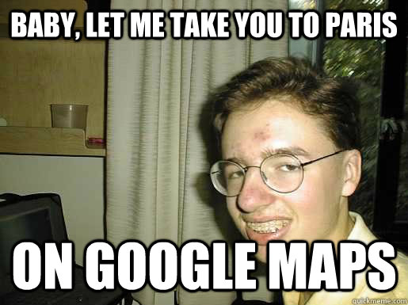

# Monday, October 26th



## Integrating Google Maps
[Official Google Documentation](https://developers.google.com/maps/tutorials/fundamentals/adding-a-google-map)

### Load the API into index.html
```html
<script src="https://maps.googleapis.com/maps/api/js"></script>
```

### Create and configure the map
The Map constructor takes in two arguments:
<br>
<br>
1) Where the map will be loaded
<br>
2) Options for the map
```javascript
function initialize() {
  var mapCanvas = document.getElementById('map');
  var mapOptions = {
    center: new google.maps.LatLng(48.856614, 2.352222),
    zoom: 8,
    mapTypeId: google.maps.MapTypeId.ROADMAP
  }
  var map = new google.maps.Map(mapCanvas, mapOptions);
}
```
- `center` is a LatLong object that tells the API where to center map
- `zoom` is a number between 0 (farthest) and 22 that sets the zoom level
- `mapTypeId` is used to specify what type of map to use
<br>
Choices are ROADMAP, SATELLITE, HYBRID, or TERRAIN.

### Execute initialize function
Calls `initialize` function when the page has finished loaded to prevent errors searching for a `div` that doesn't exist yet.
```javascript
function initialize(){
  ....
}
google.maps.event.addDomListener(window, 'load', initialize);
```
You can also place `initialize()` in a separate JS file, then call it in your index.html.
<br>
<br>
Feel free to use either on your page

### Mini challenges
- Change map's center to a place of your choosing
[Lat/Long finder](http://www.latlong.net/)
- Adjust zoom so streets in the area are readable
- Try each of the map types
- Adjust your map size
- ** Display two maps with different options and relevant titles. You will need to edit the HTML and CSS

## Diving Deeper into the API
- Get your API key from Google [Here](https://developers.google.com/maps/documentation/javascript/get-api-key)
- Place your key in jsMap.html
- Adjust map setting to you liking

## Adding Markers

[Read me to improve expand knowledge of overlays](https://developers.google.com/maps/documentation/javascript/overlays)
<br>
<br>
Marker placed on map construction
```javascript
var map;
function initMap() {
  var myLatLng = {lat: 39.757609, lng: -105.007005};

  map = new google.maps.Map(document.getElementById('map'), {
    zoom: 10,
    center: myLatLng,
    mapTypeId: google.maps.MapTypeId.ROADMAP
  });

  var marker = new google.maps.Marker({
    position: myLatLng,
    map: map,
    title: 'I\'m a Marker!'
  });
}
```
Declaring an addMarker function outside initMap() allows you to add markers dynamically
```javascript
var map;
var marker;
function initMap() {
  var myLatLng = {lat: 39.757609, lng: -105.007005};

  map = new google.maps.Map(document.getElementById('map'), {
    zoom: 10,
    center: myLatLng,
    mapTypeId: google.maps.MapTypeId.ROADMAP
  });

  addMarker(myLatLng, "I\'m a marker!");
}

function addMarker(location, title){
  marker = new google.maps.Marker({
    position: myLatLng,
    map: map,
    title: title
  });
}
```

### Removing Markers
To remove markers, pass the argument `null` to setMap()
```javascript
var map;
var marker;
function initMap() {
  var myLatLng = {lat: 39.757609, lng: -105.007005};

  map = new google.maps.Map(document.getElementById('map'), {
    zoom: 10,
    center: myLatLng,
    mapTypeId: google.maps.MapTypeId.ROADMAP
  });

  addMarker(myLatLng, "I\'m a marker!");
}

function addMarker(location, title){
  marker = new google.maps.Marker({
    position: location,
    map: map,
    title: title
  });
}

function removeMarker(){
  marker.setMap(null)
}
```

## Exercise
- Declare a function called userInputMarker that adds a new marker to the map based on the Lat/Long entered by the user.
- Add a button that calls a function to change the map center to the Lat/Long entered by the user.
- Create a function/button that changes the map type.
